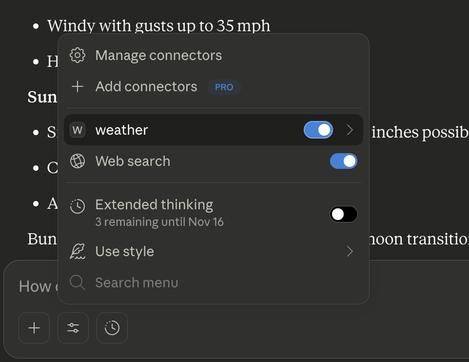

## How the LLM Uses These Tools

### Example 1: Weather Alerts

**You:** "Are there any weather alerts in California?"

**Claude's process:**
1. Recognizes it needs weather alert info
2. Calls `get_alerts(state="CA")`
3. Gets the formatted response
4. Presents it to you in natural language

### Example 2: Weather Forecast

**You:** "What's the weather forecast for San Francisco?"

**Claude's process:**
1. Knows SF coordinates (or looks them up)
2. Calls `get_forecast(latitude=37.7749, longitude=-122.4194)`
3. Gets 5-period forecast
4. Summarizes it for you

### Update the claude config file claude_desktop_config.json to below content

{
  "mcpServers": {
    "weather": {
      "command": "/Users/santhosh.sharma/.local/bin/uv",
      "args": [
        "--directory",
        "/Users/santhosh.sharma/Repositories/mcp-weather",
        "run",
        "weather.py"
      ]
    }
  }
}

#### Reference : https://modelcontextprotocol.io/docs/develop/build-server#python
Analyze logs in ~/Library/Logs/Claude/mcp.log

### When you ask Claude (with this MCP server connected):

### Docstring best practises:
1. First line = One-line summary (imperative mood: "Get", "Format", "Calculate")
2. Use present tense ("Returns the sum" not "Will return")
3. Be specific about parameter types and expected values
4. Include examples for complex functions
5. Keep it updated when code changes